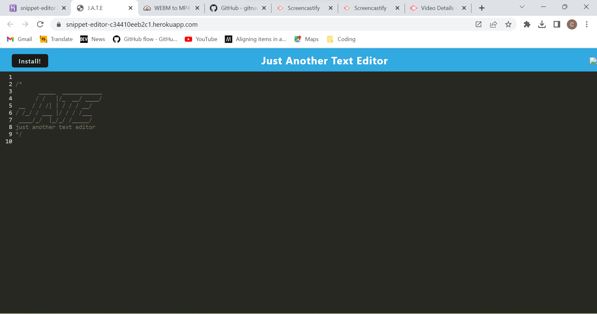
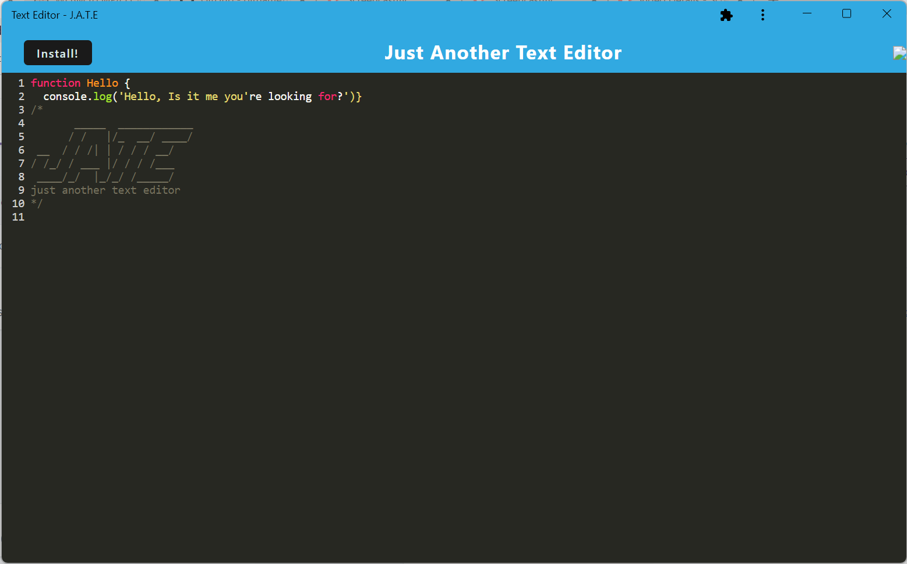

# Text Editor

## Description
Text editor empowers you to craft expressive notes and code snippets seamlessly, regardless of your internet connection. 

## Table of Contents
* [Description](#description)
* [Installation](#installation)
* [License](#license)
* [Contributing](#contributing)

## Installation
This application features a PWA that is easly to install by clicking on the install button. It can also be accessed through the browser.   To access the code you will need to clone the repo and use webpack to build the dist folder after editing any aspects of the code that you would like changed.

## Usage

https://github.com/CherylHemphill/Text-Editor/assets/126039394/aa575035-f50d-4fa7-9151-e8a2476271bb

Browser view:

 
PWA view:

## License

This project is licensed under the [MIT](https://opensource.org/licenses/MIT) license. Click the badge above for more details.

## Contributing
[Contributor Covenant](https://www.contributor-covenant.org/)

## Questions
For any questions, please contact me via:
* GitHub: [CherylHemphill](https://github.com/CherylHemphill)
